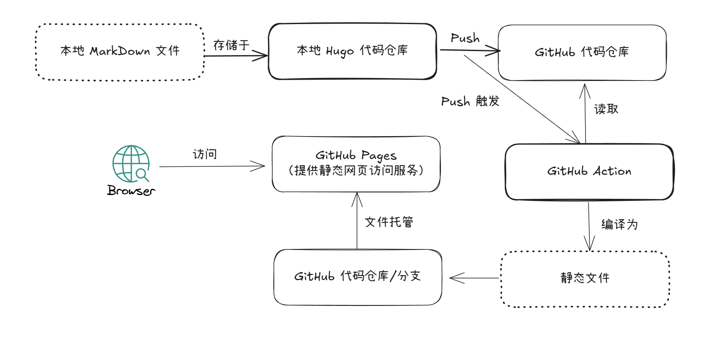
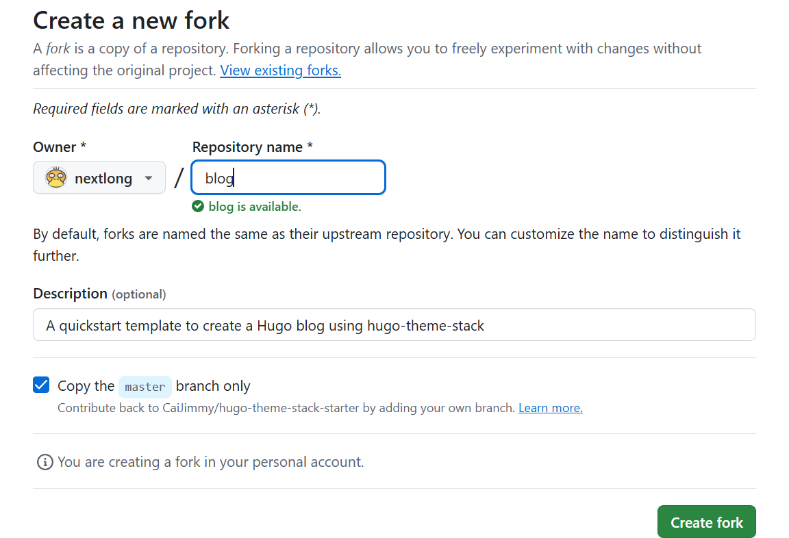
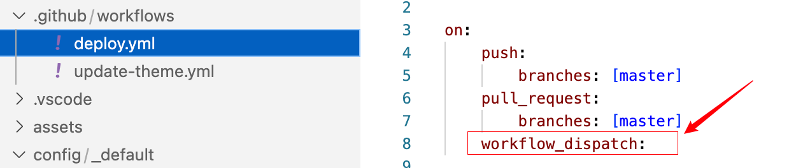
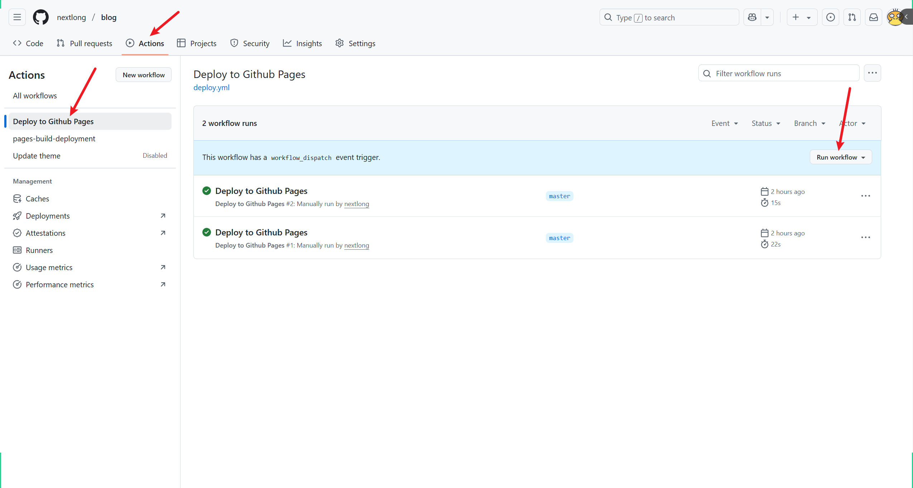
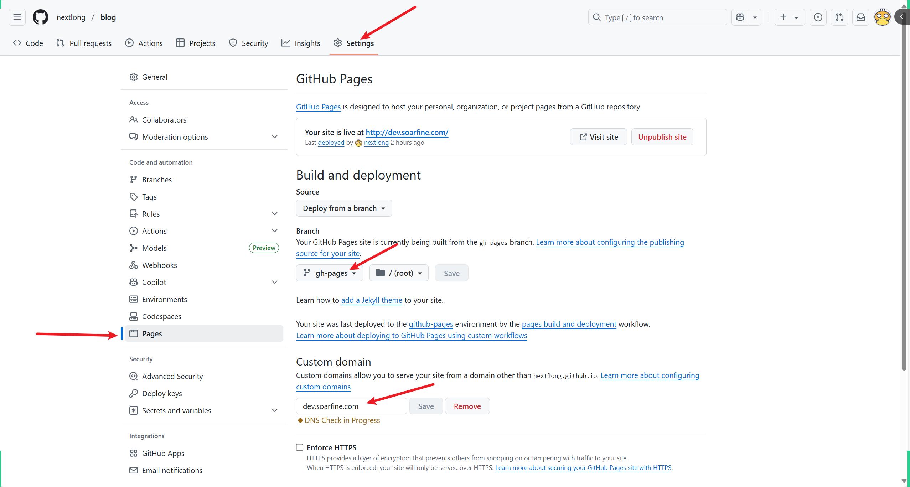
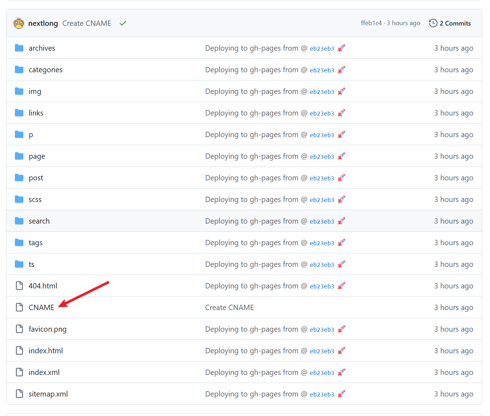
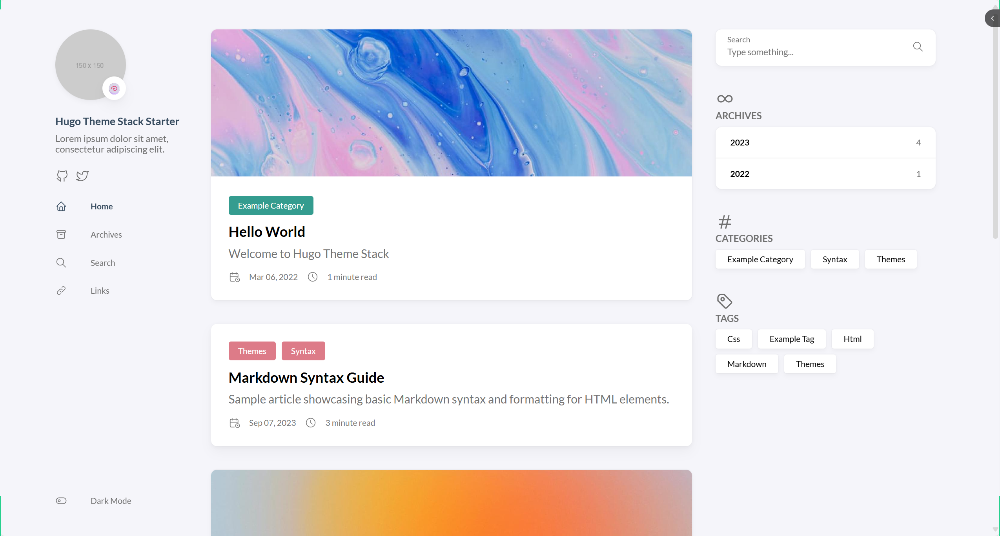

## 搭建思路

### 什么是 GitHub Pages？

GitHub Pages 是 GitHub 提供的一项静态网站托管服务，允许用户直接从 GitHub 仓库中托管和发布静态网页（如 HTML、CSS、JavaScript 等文件），且完全免费，非常适合用于搭建个人博客、项目文档、作品集等。

### 什么是 Hugo？

Hugo 是一个快速、现代的静态网站生成器，用 Go 语言开发，专注于性能和易用性。它能将 Markdown、HTML 等源文件转换为可直接部署的静态 HTML 网站，非常适合构建博客、文档、个人主页、项目网站等。

### 什么是 GitHub Action？

GitHub Actions 是 GitHub 提供的持续 CI/CD（持续集成 / 持续部署）工具，它允许你在 GitHub 仓库中自动化各种软件开发流程，比如代码测试、构建、部署、Issue 处理等。简单来说，你可以通过编写配置文件，让 GitHub 在特定事件（如代码推送、PR 提交等）发生时自动执行一系列预定操作。

### hugo-theme-stack-starter：Hugo+Stack 主题博客快速部署项目

基于 Hugo 的静态网站生成功能，开发者创建了众多风格各异的主题模板。其中，Stack 主题因其精美的页面设计和丰富的功能特性而备受关注。

为了进一步简化开发流程，Stack 作者 Jimmy 开源了一个集成 Hugo+ Stack 主题快速部署博客的项目 hugo-theme-stack-starter。此外，该模板还集成了 GitHub Action，能够在本地完成内容编辑后，自动触发 GitHub Action，完成静态网站构建、部署流程，确保发布过程的自动化与高效性。

我们只需要 fork hugo-theme-stack-starter 项目，完成基础配置后即可完成博客搭建。

## 博客工作流程

## 搭建步骤

### Fork [hugo-theme-stack-starter](https://github.com/CaiJimmy/hugo-theme-stack-starter) 代码仓库

Fork 到个人账户下的代码仓库如果没有域名的话可以使用 GitHub 提供的域名，不过需要 Fork 后的仓库名位 ${github_username}.github.io，后续可以直接通过 ${github_username}.github.io 域名来直接访问个人博客。

这里我准备使用个人域名，所以仓库名可以任意定义。

### 触发博客部署的 GitHub Action 工作流

我们使用的这个快速博客部署项目在我们代码提交到你GitHub 仓库后会自动,触发 GitHub 工作流，Master 分支中的文件会被编译为静态网页，然后发布到 gh-pages 分支上。

首次 Frok 之后的代码仓可能并没有触发 GitHub Action ，我们可以通过手动触发来完成首次的静态网页编译与发布。

直接修改 Master 分支下 .github/workflows 目录下的 deploy.yml 文件，在原有的代码更新触发 GitHub Action 之外，增加一种手动触发工作流的方式。

后续我们就可以通过 Actions 模块来手动完成工作流的触发。

### 域名解析指向 GitHub

### 完成 GitHub Pages 的配置及域名绑定

点击 Seetings，进入 Secrets and variable 一栏，选择 Pages 栏目，选择部署分支为 gh-pages，即可指向 GitHub Pages 到我们的静态页面分支。

接下来在 Custom domain 中完成已解析域名的绑定。

如下图所示，完成域名绑定后，目标分支下会生成个 CNAME 文件，如果我们点开看的话，文件内容只有一行，内容为我们刚才绑定的域名。

### 直接通过域名即可成功访问博客

后续完成个性化配置就可以正常通过博客发布文章了，如下图所示 Stack 主题给我们提供了一些 Demo 文章案例，我们可以在编辑文章时进行参考。当然也可以直接参考 Hugo 官网文档说明来完成一些配置。

