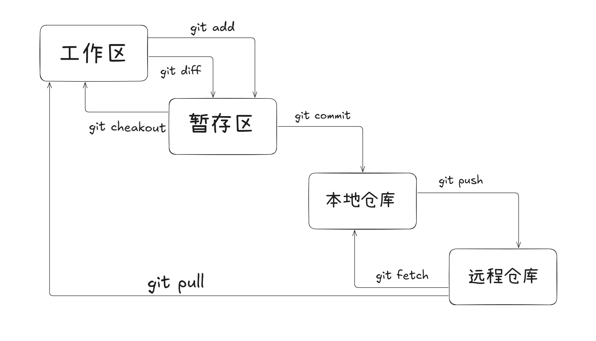

### 什么是 Git？

Git 是一个分布式版本控制系统，用于跟踪文件的修改历史，方便多人协作开发和管理项目。

与传统的集中式版本控制系统不同，Git的每个工作目录都是一个完整的代码仓库，具有完整的历史记录和版本跟踪能力。

### 为什么要使用 Git？

#### 版本控制：

可以回溯到任意历史版本

#### 团队协作：

多人可以同时工作在同一个项目上

#### 分支管理：

轻松创建、合并分支，实现不同功能并行开发

#### 备份保障：

每个开发者都有完整的项目历史

### Git 基本概念

#### 四个区域

##### 工作区：

用户直接编辑文件的目录，即本地项目文件夹（可见的代码文件）。

##### 暂存区：

临时存放工作区改动的中间区域，是提交前的缓冲地带。

##### 本地仓库：

存储项目完整历史记录的数据库（位于 .git 目录中）。

##### 远程仓库：

托管在服务器上的仓库（如 GitHub、GitLab）。

#### 文件状态：

##### 已修改：

修改了但是没有保存到暂存区的文件。

##### 已暂存：

修改后已经保存到暂存区的文件。 

##### 已提交：

把暂存区的文件提交到本地仓库后的状态。

### Git 的使用

#### 初始化设置

##### 配置用户名：

git config --global user.name "Name"

##### 配置邮箱：

git config --global user.email "mail"

##### 存储配置：

git config --global credential.helper store

#### **仓库初始化与克隆**

##### 创建目录并进入：

mkdir learn-git

cd learn-git

##### 初始化本地仓库：

git init

##### 克隆远程仓库：

git clone <仓库地址>

#### 文件操作

##### 创建文件并写入内容：

echo "内容" > 文件名.txt

##### 查看文件内容：

cat 文件名.txt

##### 列出目录文件（含隐藏文件）：

ls -al

##### 删除本地文件：

rm 文件名

#### 暂存与提交

##### 添加文件到暂存区：

git add 文件名（单个文件）

git add *.txt（所有 .txt 文件）

git add .（当前目录所有文件）

##### 查看暂存区文件：

git ls-files

##### 提交更改：

git commit -m "提交说明"

##### 从暂存区移除文件（保留工作区文件）

git rm --cached 文件名

##### 彻底删除文件（工作区 + 暂存区）：

git rm 文件名

git rm -r *（递归删除所有文件及子目录）

#### 状态与日志

##### 查看仓库状态

git status

##### 查看提交记录

git log（完整记录）

git log --oneline（简洁记录）

#### 版本回退与比较

##### 回退版本

git reset --soft（保留工作区和暂存区修改）

git reset --mixed（保留工作区修改，默认方式）

git reset --hard（彻底回退，丢弃所有修改）

#### 比较文件差异

##### 工作区、暂存区

git diff

##### 工作区、最新提交

git diff HEAD

##### 暂存区、最新提交

git diff --cached

##### 比较两个版本

git diff  版本号1 版本号2

##### 当前版本、上一版本

git diff HEAD~ HEAD

##### 当前版本、前第 N 个版本

git diff HEAD~N HEAD